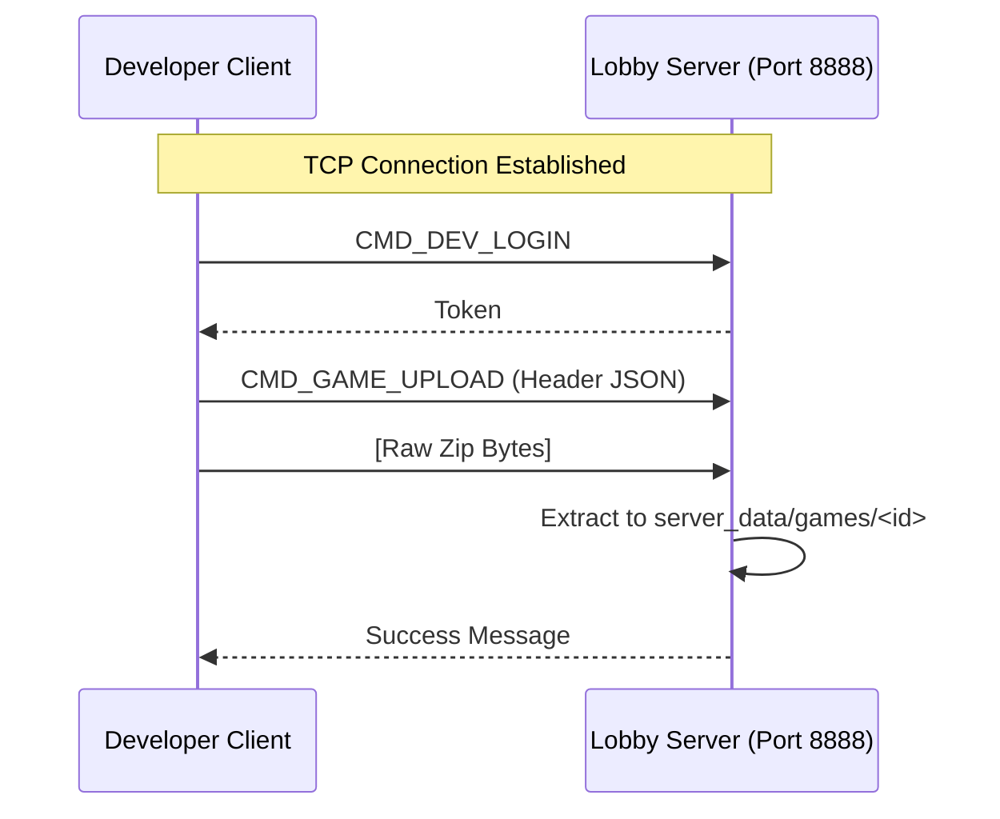
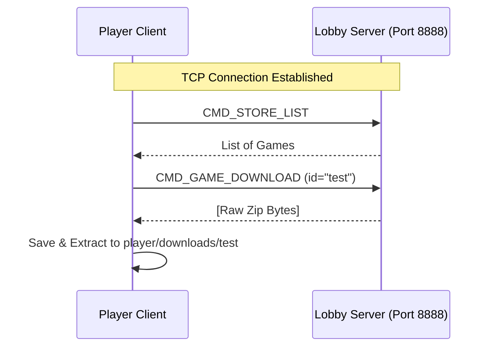

# Game Store System - Architecture & Connection Flow

This document details how the Game Store System manages connections, processes, and data flow between its various components.

## 1. System Overview

The system follows a **Lobby-based Architecture** similar to platforms like Steam or Battle.net, but with a simplified dedicated server model for game sessions.

There are **two types of network connections** in this system:
1.  **Lobby Connection (Persistent)**: Handles login, store, chat, and matchmaking.
2.  **Game Connection (Ephemeral)**: Handles the actual gameplay data for a specific match.

## 2. Component Roles

| Component | Run By | Role | Process Type |
| :--- | :--- | :--- | :--- |
| **Lobby Server** | Server Admin | Central hub. Manages `users.json`, `games.json`, and active Rooms. | **Main Process** (Persistent) |
| **Developer Client** | Game Dev | Tool to upload/update game packages to the Lobby Server. | Client Process |
| **Player Client** | Player | The "Launcher". Browses store, downloads games, joins rooms. | Client Process |
| **Game Server** | **Lobby Server** | A dedicated server instance for a *single specific match*. | **Subprocess** (Spawned by Lobby) |
| **Game Client** | **Player Client** | The actual game window/logic that the player plays. | **Subprocess** (Spawned by Player) |

---

## 3. Connection Flows

### A. Developer Workflow (Upload)
A simple Request/Response cycle over the main TCP connection.



### B. Player Workflow (Lobby & Download)
The Player Client connects to the Lobby Server to manage their account and library.



### C. Game Session Lifecycle (The Complex Part)
This is where the system spawns new processes and establishes new connections.

**Key Definition**: 
*   **Lobby Server** does NOT relay game data. It only introduces the players to the Game Server.
*   **Game Manager** is a class inside Lobby Server, not a separate server.

```mermaid
sequenceDiagram
    participant P1 as Player 1 (Host)
    participant P2 as Player 2 (guest)
    participant Lobby as Lobby Server
    participant GM as Game Manager (Internal)
    participant GS as Game Server (Process)
    participant GC1 as Game Client 1 (Window)
    participant GC2 as Game Client 2 (Window)

    Note over P1, Lobby: In Room (Waiting)

    P1->>Lobby: CMD_GAME_START_NOTIFY (Press 's')
    Lobby->>GM: start_game(room_id)
    
    Note over GM, GS: 1. SPAWN PROCESS
    GM->>GS: subprocess.Popen("python server.py <port>")
    GS->>GS: Listen on 0.0.0.0:<port> (e.g. 9005)
    
    GM-->>Lobby: Return IP="140.113.x.x", Port=9005
    
    Lobby-->>P1: CMD_GAME_START (IP, Port)
    Lobby-->>P2: CMD_GAME_START (IP, Port)
    
    Note over P1, GC1: 2. SPAWN CLIENT 1
    P1->>GC1: subprocess.Popen("python client.py <IP> <Port>")
    
    Note over P2, GC2: 2. SPAWN CLIENT 2
    P2->>GC2: subprocess.Popen("python client.py <IP> <Port>")
    
    Note over GC1, GS: 3. DIRECT GAME CONNECTION
    GC1->>GS: socket.connect((IP, Port))
    
    Note over GC2, GS: 3. DIRECT GAME CONNECTION
    GC2->>GS: socket.connect((IP, Port))
    
    loop Gameplay
        GC1<->GS: Game Data (movement, actions...)
        GC2<->GS: Game Data
    end
```

## 4. Key Code Locations

### Server Side
*   **`server/request_handler.py`**: Handles the TCP `8888` requests (Login, Upload, Create Room).
*   **`server/game_manager.py`**: 
    *   `start_game()`: Allocates a free port and runs `subprocess.Popen` to start the Game Server.
    *   **Crucial Fix**: It now auto-detects the public LAN IP to send to players, solving `Connection Refused` errors.

### Player Side
*   **`player/player.py`**: 
    *   Connects to standard `8888`.
    *   `wait_room()`: Listens for `CMD_GAME_START` signal.
    *   `launch_game()`: When signal arrives, calls `self.launcher`.
*   **`player/game_launcher.py`**:
    *   `launch()`: Reads `config.json` to find the entry point (e.g., `client.py`) and runs `subprocess.Popen` with the provided IP/Port arguments.

### Game Side (The "Test" Game)
*   **`games/test/server.py`**: 
    *   Standard socket server.
    *   **Does not know about Lobby Server**. Just binds to the port it was told to use.
*   **`games/test/client.py`**:
    *   Standard socket client.
    *   **Does not know about Player.py**. It just connects to the `sys.argv` IP/Port it was given.
